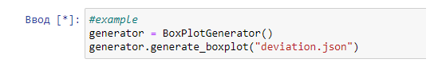
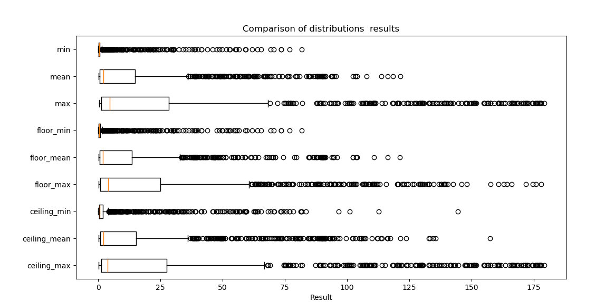
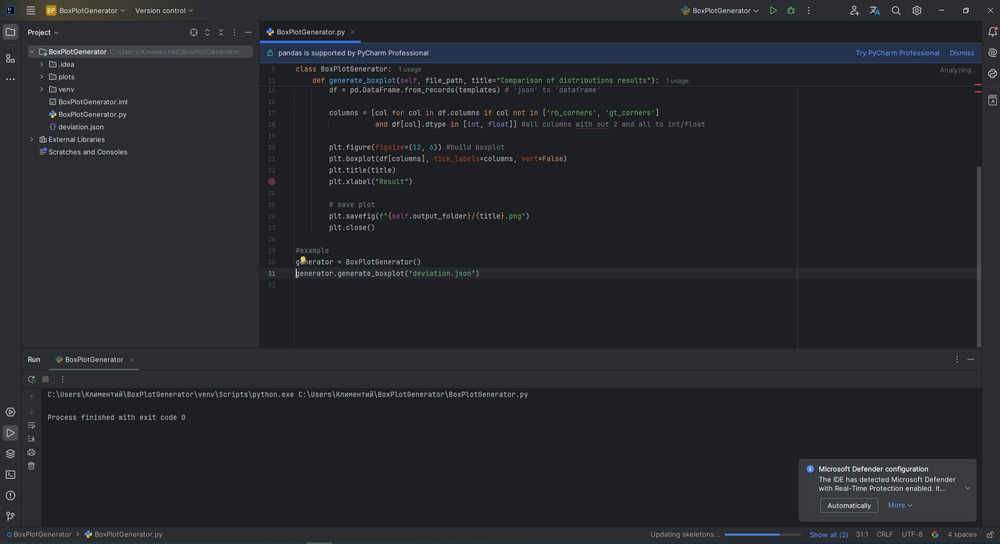
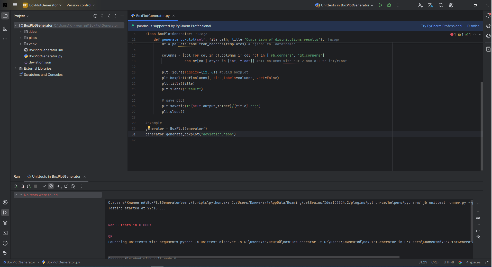
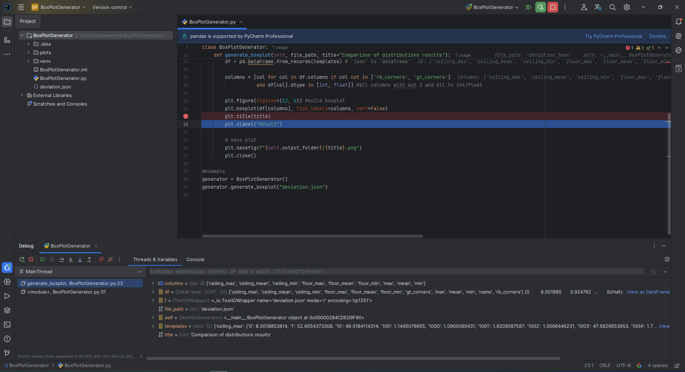

# Trainee-Python-developer-
Данный код -  инструмент, который позволяет генерировать графики cравнениий и распределений значений для каждого столбца, открывая из файла формата json и сохраняя в формате картинки в папку plots.
## Содержание
* [Установка](#установка)  
* [Использование](#использование)  
* [intellij idea](#intellij-idea)  

## Установка
* *Установите  необходимые  библиотеки:*  `pip install -r requirements.txt` 
## Использование
* *Создайте класс и вызовите функцию от вашего файла в формате json:*  `generator = BoxPlotGenerator(); generator.generate_boxplot("deviation.json")`
*   
* *Откройте папку plots и смотрите на график:* 
*   
## intellij idea
* *Запустил свое приложение в intellij idea*
*   
* *Показал использование юнит тестов*
*   
* *Профайлер используется для языка джава ( насколько я знаю). Так что чисто физически выполнить не смог* 

* *Показал использование дебагера*
*   
